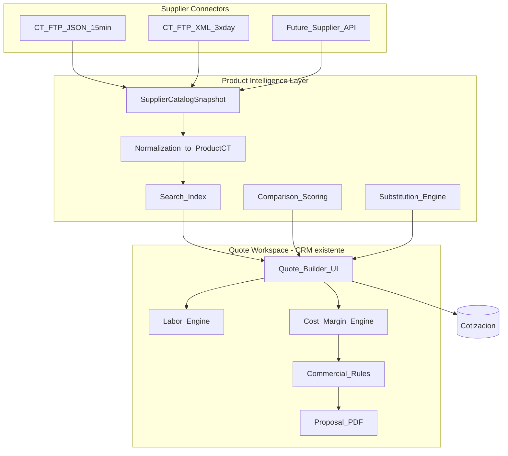

# Smart Quote Engine — Diseño aterrizado (Nexara)

**Estado:** Implementado por fases (0–4) en código — 2026-08-21  
**Decisión comercial:** Extender el CRM de cotizaciones existente (opción A)  
**Primer mayorista:** CT Online (feed FTP validado)  
**Fuente primaria:** `productos.json` (cada ~15 min)  
**Fuente secundaria:** `productos.xml` (catálogo completo, 3×/día)  
**Módulo:** `apps/api/src/smart-quote/` · UI: `/crm/quotes/builder` · Doc diseño: este archivo

---

## 0. Hallazgos del FTP (validado por comando)

| | |
|---|---|
| Host | `216.70.82.104` |
| Ruta | `/catalogo_xml/` |
| JSON | `productos.json` ~5 MB, **5 740 SKUs con existencia**, actualizado ~cada 15 min |
| XML | `productos.xml` ~31 MB, total con/sin stock, 3×/día |
| Origen | CT Online (`static.ctonline.mx`) |
| Cuenta | Prefijo `PUE` → almacén Puebla en `existencia` |

### Schema real del JSON (coincide 1:1 con `ProductCT`)

```json
{
  "idProducto": 16648,
  "clave": "ACPTPL210",
  "numParte": "CPE210",
  "nombre": "Access Point Exterior TP-LINK CPE210",
  "modelo": "CPE210",
  "marca": "TP-LINK",
  "categoria": "Red Activa",
  "subcategoria": "Access Points",
  "descripcion_corta": "...",
  "ean": "...",
  "upc": "...",
  "sustituto": "ACPTPL210",
  "activo": 1,
  "protegido": 0,
  "existencia": { "TPC": 1, "DFA": 7, "PUE": 0 },
  "precio": 37.5,
  "moneda": "USD",
  "tipoCambio": 17.04,
  "especificaciones": [{ "tipo": "...", "valor": "..." }],
  "promociones": [],
  "imagen": "https://static.ctonline.mx/..."
}
```

**Snapshot actual:** 181 marcas · 50 categorías · ~783k unidades en red CT · precios USD/MXN · 46 códigos de almacén · campo `sustituto` nativo.

**Credenciales:** solo en secrets/env (`CT_FTP_*`). Nunca en repo, commits ni docs versionados.

---

## 1. Principio de producto

No construir “otro formulario de cotización”.

Construir el **sistema operativo comercial** de Nexara:

> Requerimiento → productos CT vivos → mejores opciones (precio / stock / lead / margen) → mano de obra + logística → margen real → propuesta profesional → OC / proyecto.

**UX objetivo (opción A):** el vendedor sigue en `/crm/quotes`, pero el armado deja de ser texto libre y pasa a ser **búsqueda + comparación + 1-click add**.

---

## 2. Qué ya existe en Nexara (no reinventar)

| Capacidad | Dónde vive | Estado |
|-----------|------------|--------|
| Cotización CRM + PDF + firma | `Cotizacion`, `CotizacionItem`, `apps/api/src/cotizaciones/*`, `apps/web/app/(panels)/crm/quotes/*` | Live |
| Mano de obra en línea | `laborHours` × `laborRate` en `cotizacion-totals.ts` | API sí · UI create débil |
| Catálogo tenant | `Product` + `catalog/*` | Live (manual) |
| Schema CT legacy | `ProductCT` (`productos_ct`) + `SupplierProduct` | Schema exacto · **sin sync** |
| Multi-fuente | `ProductSource` | Schema · sin jobs |
| Mayorista comercial | `Supplier.esMayorista`, `SupplierPriceBreak`, `procurement/wholesale/*` | Live (términos, no feed) |
| Picker de catálogo | `apps/web/components/CatalogPicker.tsx` | Existe · **no cableado a quotes** |
| Jobs | `JobQueueService` (BullMQ/Redis) + `basic-ftp` en deps | Listo para sync |
| BOM | `BillOfMaterials` | Schema P2 · no cotizaciones |
| Márgenes proyecto | `SalesProject.margin` + `MARGIN_ALERT` | Parcial · no en líneas de quote |

---

## 3. Arquitectura objetivo (modular)



### Módulos NestJS a crear

```
apps/api/src/smart-quote/
  smart-quote.module.ts
  connectors/
    ct-ftp.connector.ts          # download JSON/XML
    supplier-connector.ts        # interface
  sync/
    ct-catalog-sync.service.ts   # upsert ProductCT + SupplierProduct
    ct-catalog-sync.job.ts       # JobQueue register: supplier.ct.sync
  search/
    product-search.service.ts    # SKU/marca/modelo/specs/fulltext
  scoring/
    quote-scoring.service.ts     # best price / stock / value / margin
  labor/
    labor-catalog.service.ts     # tabuladores
  rules/
    commercial-rules.service.ts  # margen mínimo, alertas
  smart-quote.controller.ts      # search, score, suggest-labor, add-lines
```

Web (sobre CRM actual):

```
apps/web/app/(panels)/crm/quotes/
  new/page.tsx                   # wizard 7 pasos (o rediseño create)
  [id]/builder/page.tsx         # workspace de armado
components/smart-quote/
  SmartProductSearch.tsx         # reemplaza/extiende CatalogPicker
  OfferCards.tsx                 # Best Price / Fastest / Best Margin / Recommended
  QuoteCostPanel.tsx             # vista interna costo/margen
  LaborTabulatorPanel.tsx
```

---

## 4. Arquitectura de datos

### 4.1 Capas

1. **Raw snapshot** — JSON/XML bajado del FTP (auditoría + reprocess).
2. **Supplier mirror** — `ProductCT` + `SupplierProduct` (precio/stock/lead del mayorista).
3. **Tenant sell catalog** — `Product` (opcionalmente enlazado; precio de venta Nexara).
4. **Quote document** — `Cotizacion` / `CotizacionItem` (lo que ve el cliente + campos internos nuevos).

### 4.2 Decisiones de modelo

| Decisión | Elección | Por qué |
|---------|----------|---------|
| Dónde aterriza el feed CT | `ProductCT` + `SupplierProduct` | Schema ya es el mirror CT; no inventar tabla paralela |
| Relación a cotización | `CotizacionItem.productId` → `Product` tenant; + `supplierProductId` nuevo opcional | Mantener PDF/cliente limpio; costo interno por supplier line |
| Sync primario | JSON cada 15 min | Stock/precio fresco para cotizar YA |
| Sync secundario | XML 3×/día | Completar catálogo sin stock (equivalentes / bajo pedido) |
| Moneda | Guardar `precio`+`moneda`+`tipoCambio`; calcular MXN al cotizar | Respeta feed CT |
| Stock | Sumar `existencia` + preferir almacén `PUE` / configurable | Cuenta es PUE |

### 4.3 Entidades nuevas (MVP+)

```
SupplierCatalogSyncRun
  id, supplierId, source(JSON|XML), startedAt, finishedAt, status,
  rowsRead, rowsUpserted, error, fileModifiedAt, checksum

LaborRateCard (tabulador)
  id, companyId, code, name, category(INSTALL|ENGINEERING|SUPPORT|LOGISTICS),
  unit(PIECE|HOUR|METER|JOB), cost, price, marginPercent,
  defaultHours, technicians, active

LaborRule
  id, companyId, triggerCardId, matchCategory?, matchItemType?,
  formula(FIXED|PER_QTY|HOURS_X_TECH), params Json

CommercialRule
  id, companyId, scope(CATEGORY|BRAND|GLOBAL|CLIENT),
  minMarginPercent, maxDiscountPercent, requiresApprovalBelow

CotizacionVersion (post-MVP cercano)
  id, cotizacionId, version, snapshot Json, createdById, createdAt, note

# Extensiones CotizacionItem (migración)
  unitCost Decimal?          # costo proveedor al momento
  supplierId Int?
  supplierSku String?
  marginPercent Decimal?
  stockSnapshot Int?
  leadTimeDays Int?
  scoreReason String?        # "BEST_PRICE" | "FASTEST" | ...
  optimizationMode String?   # modo usado al elegir
```

`Product` tenant se puede **materializar bajo demanda** al agregar a cotización (create-from-CT) para no obligar a importar 5k+ SKUs al catálogo de venta de golpe.

---

## 5. Integración CT — conector

### Contrato `SupplierConnector`

```ts
interface SupplierConnector {
  code: 'CT' | string;
  pullPrimary(): Promise<PullResult>;   // JSON
  pullFull?(): Promise<PullResult>;     // XML
  normalize(row: unknown): NormalizedSupplierProduct;
}
```

### Job `supplier.ct.sync`

1. FTP login (env) → download `/catalogo_xml/productos.json` si `modifiedAt` cambió.
2. Parse stream/array → upsert `ProductCT` por `clave` / `idProducto`.
3. Upsert `SupplierProduct` (supplier = CT, price, stock sum + por almacén en Json, leadTime default).
4. Registrar `SupplierCatalogSyncRun`.
5. (Opcional cron noche) mismo flujo con XML para SKUs sin stock.

### Env (ejemplo, sin secretos)

```
CT_FTP_HOST=216.70.82.104
CT_FTP_USER=
CT_FTP_PASSWORD=
CT_FTP_SECURE=0
CT_FTP_PATH=/catalogo_xml
CT_FTP_JSON_FILE=productos.json
CT_FTP_XML_FILE=productos.xml
CT_SUPPLIER_CODE=CT
CT_PREFERRED_WAREHOUSE=PUE
CT_SYNC_CRON_MINUTES=15
```

`basic-ftp` ya está en `apps/api/package.json` — primer uso real.

---

## 6. Búsqueda (MVP sophistication)

### Índices

- Postgres: `GIN` / `pg_trgm` sobre `clave`, `numParte`, `nombre`, `modelo`, `marca`, `categoria`, `descripcion_corta`.
- Filtros: marca, categoría, stock>0, moneda, precio MXN rango.
- Specs: JSON path / flatten a `spec_kv` opcional en fase 2.

### API

`GET /smart-quote/search?q=&brand=&category=&optimize=BALANCE|PRICE|SPEED|MARGIN|PREMIUM`

Respuesta: hits rankeados + badges (`BEST_PRICE`, `BEST_STOCK`, `FASTEST`, `BEST_MARGIN`, `RECOMMENDED`).

### Lenguaje natural (fase 3)

LLM interpreta → filtros estructurados → misma search API. El copilot **no** inventa precios; solo traduce a query.

---

## 7. Algoritmo de scoring (configurable)

```
score =
  wPrice   * priceScore +
  wStock   * stockScore +
  wLead    * leadScore +
  wMargin  * marginScore +
  wBrand   * brandPreference +
  wPromo   * promoBonus
```

Defaults modo **BALANCE:** 30 / 20 / 20 / 15 / 10 / 5.

Modos preset:

| Modo | Enfoque |
|------|---------|
| PRICE | min costo MXN |
| SPEED | max stock en `PUE`/red + lead corto |
| MARGIN | max (sell − cost) / sell dado target margin |
| PREMIUM | marca preferida + specs |
| BALANCE | pesos default |

Sustitutos: si `stock==0` o lead alto → expandir por `sustituto`, misma subcategoría + specs cercanas.

---

## 8. Motor de precios y márgenes

```
costMxn = moneda==USD ? precio * tipoCambio : precio
nexaraCost = costMxn + logisticsAlloc + laborCost
sell = nexaraCost / (1 - targetMargin)
final = sell * (1 + IVA)
```

Vista interna en builder: costo · margen % · utilidad · alerta si &lt; `CommercialRule.minMarginPercent`.

Vista cliente (PDF): nunca costo/proveedor/almacén.

---

## 9. Motor de mano de obra (tabuladores)

Catálogo `LaborRateCard` + reglas por categoría de producto:

| Código | Ejemplo | Unidad |
|--------|---------|--------|
| CAM_INSTALL | Instalación cámara | por pieza |
| AP_INSTALL | Instalación AP | por pieza |
| RACK_INSTALL | Instalación rack | por job |
| CABLING_M | Cableado | por metro |
| CONFIG_H | Configuración | por hora |
| COMM_START | Puesta en marcha | por job |

Fórmulas: `PER_QTY`, `HOURS_X_TECH`, `FIXED`.

Al agregar N cámaras → sugerir líneas de servicio (aceptar/rechazar). Reutiliza `laborHours`/`laborRate` existentes en `CotizacionItem` o líneas `itemType=LABOR/SERVICE` en `Product`.

---

## 10. Logística (fase 2)

Reglas por ciudad/distancia/peso; línea de servicio `LOGISTICS`. MVP: campo manual + plantillas por zona (CDMX / PUE / foráneo).

---

## 11. Reglas comerciales

- Margen mínimo global / por categoría / por marca.
- Descuento máximo.
- Productos `protegido` del feed → flag + aprobación.
- Alerta bloqueante o soft según rol (`SALES` vs `SALES_MANAGER`).

---

## 12. Cotización profesional + vistas

- Mejorar `cotizacion-pdf.ts`: portada Nexara, alcance, exclusiones, garantías, vigencia.
- Templates ya en CRM (`OrderTemplate` / templates page) — reutilizar branding.
- Toggle UI **Interna / Cliente** en el builder.

---

## 13. Versionamiento

`CotizacionVersion` snapshot JSON en cada send / approve / restore. Corto plazo: version label en `SalesOpportunityQuote` ya existe — extender.

---

## 14. AI Copilot (fase 3)

Input NL → structured intent → search + BOM suggest + labor suggest → draft `Cotizacion` DRAFT.  
Guardrails: precios solo del mirror CT sync’eado; reglas comerciales siempre aplican.

---

## 15. Flujo UX (opción A — 7 pasos en CRM)

1. Cliente + proyecto (+ oportunidad opcional)  
2. Necesidad (texto / búsqueda)  
3. Resultados con Offer Cards  
4. Optimizar por: Precio / Rápido / Margen / Balance  
5. Auto: accesorios sugeridos + tabulador MO + logística plantilla  
6. Revisión interna (costo/margen)  
7. PDF / enviar / firmar (flujos actuales)

Tiempo meta: cotización típica CCTV/red en **&lt; 10 minutos**.

---

## 16. Wireframes (pantallas clave)

1. **Quotes list** — CTA “Nueva cotización inteligente”  
2. **Builder header** — cliente, modo optimización, margen vivo  
3. **Search panel** — query + filtros + results  
4. **Offer card row** — 3–4 opciones rankeadas, 1-click add  
5. **BOM lines** — hardware / servicios / MO tabs  
6. **Cost rail** — costo · margen · alertas (solo interna)  
7. **PDF preview** — vista cliente  

---

## 17. Permisos y roles

| Rol | Puede |
|-----|-------|
| SALES | Buscar, armar, margen ≥ mínimo |
| SALES_MANAGER | Override margen, aprobar protegidos |
| PROCUREMENT | Ver sync CT, forzar pull, términos mayorista |
| ADMIN | Tabuladores, reglas, conectores, pesos scoring |

Reutilizar RBAC URL matrix (`url-matrix.ts`) + nuevos paths `/crm/quotes/builder`, `/erp/procurement/ct-sync`.

---

## 18. Dashboard métricas (fase 2–3)

Cotizaciones/tiempo armado · win rate · margen promedio · SKUs top · fill-rate CT · lead time prometido vs real · conversión por vendedor.

---

## 19. Roadmap por fases (impacto comercial primero)

### Fase 0 — Foundations (3–5 días)
- Secrets `CT_FTP_*` + Supplier CT en DB (`esMayorista=true`)
- Conector FTP + job sync JSON → `ProductCT` / `SupplierProduct`
- Panel mínimo “última sync” en procurement
- Tests de normalización con fixture del JSON real (sin credenciales)

### Fase 1 — MVP comercial (2–3 semanas) ★ mayor impacto
- Search API sobre `ProductCT` (trgm + filtros)
- Scoring PRICE / SPEED / MARGIN / BALANCE
- Quote builder en CRM: search → offer cards → add line con `unitCost` + sell price por margen target
- Cablear/extender `CatalogPicker` → `SmartProductSearch`
- Exponer labor hours/rate en UI create
- PDF sin filtrar costos internos
- Sustitutos básicos (`sustituto` + misma subcategoría si sin stock)

### Fase 2 — Tabuladores + reglas (2 semanas)
- `LaborRateCard` + sugerencias al agregar productos
- `CommercialRule` + alertas margen
- Sync XML nocturno
- Preferencia almacén PUE + lead time
- Versionado de cotización

### Fase 3 — Solution intelligence (3–4 semanas)
- Configurador CCTV/WiFi (cámaras → NVR → HDD → switch)
- BOM suggestions
- Logística por zona
- Dashboard inteligencia comercial

### Fase 4 — AI Copilot + multi-mayorista
- NL → draft quote
- Segundo conector (API/CSV) con misma interface
- Learning de productos ganadores / márgenes reales

---

## 20. Flujo end-to-end objetivo

```
Cliente → Requerimiento → Search CT → Scoring → BOM lines
  → Labor tabulada → Logística → Costo real → Margen/reglas
  → PDF profesional → Firma → OC procurement → Proyecto
```

---

## 21. Entregables de diseño (checklist §26)

| # | Entregable | Ubicación en este doc / código |
|---|------------|--------------------------------|
| 1 | Arquitectura sistema | §3 |
| 2 | Arquitectura datos | §4 |
| 3 | Modelo DB | §4.3 + Prisma existente |
| 4 | Entidades/relaciones | §4 |
| 5 | Catálogo productos | ProductCT mirror + Product tenant |
| 6 | Integración mayoristas | §5 (CT FTP JSON) |
| 7 | Scoring | §7 |
| 8–12 | Precio/margen/MO/logística/reglas | §8–11 |
| 13 | AI Copilot | §14 (fase 4) |
| 14–16 | UX / wireframes / flujo | §15–16 |
| 17 | Permisos | §17 |
| 18 | Versionamiento | §13 |
| 19 | Dashboard | §18 |
| 20 | Roadmap | §19 |

---

## 22. Definición de Done del MVP (Fase 1)

1. Job cada 15 min actualiza ≥ precios/stock de CT desde JSON.  
2. Desde `/crm/quotes` un vendedor busca “cámara 4MP”, ve ofertas rankeadas, agrega con un clic.  
3. La línea guarda costo CT + precio venta + margen.  
4. PDF cliente no revela costo/proveedor.  
5. Totales siguen pasando por `cotizacion-totals.ts` (IVA/MO).  

---

## 23. Riesgos y mitigaciones

| Riesgo | Mitigación |
|--------|------------|
| JSON 5 MB parse blocking | Stream/batch upsert; sync en worker |
| tipoCambio desfasado | Usar el del feed; opcional override admin |
| Duplicar Product vs ProductCT | CT = procurement mirror; Product se crea on-demand al cotizar |
| Credenciales en git | Solo env/secrets; `.tmp-ftp-inspect/` gitignored |
| Scope creep AI/configurador | Congelar fases 0–1 antes de 3–4 |

---

## 24. Próximo paso operativo

1. Reiniciar API para cargar `SmartQuoteModule`.
2. Credenciales en `apps/api/.env` (`CT_FTP_*`) — ya documentadas en `.env.example`.
3. Sync: `POST /api/smart-quote/ct/sync` o cron cada 15 min · seed local: `node apps/api/scripts/seed-ct-from-local-json.js`.
4. Abrir CRM → Cotizaciones → **Smart Quote** (`/crm/quotes/builder`).

### Implementado en repo

| Fase | Entrega |
|------|---------|
| 0 | `CtFtpConnector`, job `supplier.ct.sync`, cron 15 min + 3×/día, `ProductCT` seeded (5740) |
| 1 | `GET /smart-quote/search` + scoring + builder UI + costos en `CotizacionItem` |
| 2 | Tabuladores MO, reglas margen, versionado cotización |
| 3 | Configurador CCTV/WiFi/Access + logística por zona + sugerencia accesorios |
| 4 | `POST /smart-quote/copilot/draft` + interface `SupplierConnector` multi-mayorista |
